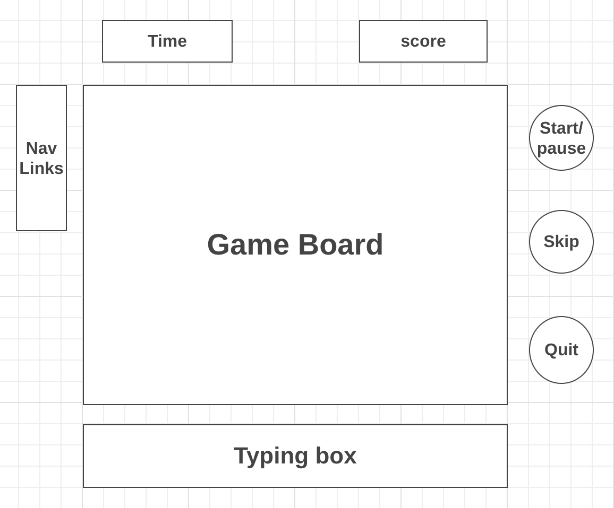

# Background

Have you ever wondered why you couldn’t practice typing while playing piano? Well “Keyboard Tiles” will become your go-to from now on because it is a game where you can practice typing and feel like as if you are playing piano. 

The original game is called “Piano Tiles” and it is an easy game where you have to simply touch the tiles that are descending in different columns. The basic idea is the same but instead of touching, “Keyboard Tiles” will require typing corresponding alphabets that are falling. It is important to type the alphabets in the descending order because each key will make a sound that corresponds to a key in a music.

# Functionality & MVPs

In “Keyboard Tiles,” users will be able to:

* Type according to the letters shown
* Listen to a random music while typing
* Check if there are any typos
* Check if the order of letters is correct

In addition, this project will include:

* Instructions
* A scoreboard
* Different levels of difficulty

# Wireframes

# Technologies, Libraries, APIs

This project will be implemented with the following technologies:
* The Canvas API to render the game board and moving tiles
* Web Audio API to make sounds
* Webpack to bundle JavaScript code

# Implementation Timeline

* Friday: Setup project, get comfortable with all the APIs that will be implemented in this project, and get canvas to show up on the screen.
* Weekend: Brainstorm and implement the underlying logic behind the game. Ensure that there are moving tiles and have a text box where I can type. If time permits, try to connect these two to make sure correctly typed letters remove the tiles.
* Monday & Tuesday: Get the audio to work and create user controls such as start/pause, skip, and quit.
* Wednesday: Focus on styling.
* Thursday: Deploy to GitHub. If time permits, rewrite this proposal.